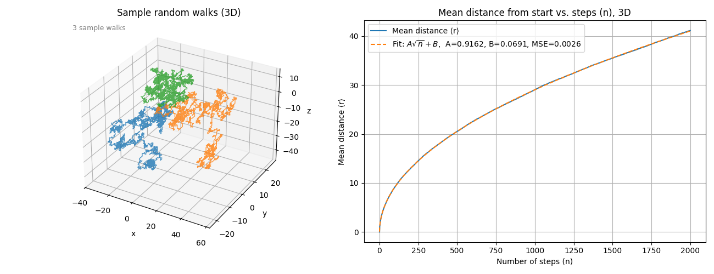

# Random Walk Simulation (2D/3D, Python)

A simple, fast, and well-documented tool for simulating **random walks** on an infinite lattice, supporting both 2D and 3D cases, with built-in curve fitting and statistical analysis of results.

---

## Features

* **Efficient simulation** of many independent random walkers on an infinite lattice (no boundaries, no wrapping).
* **Configurable dimension** (`DIM = 2` or `DIM = 3`).
* **Statistical analysis**: Runs multiple independent simulations and reports the mean and standard deviation of fitted parameters.
* **Automatic curve fitting**: Fits the mean distance from origin ⟨r⟩ as a function of steps *n* to the model
  $⟨r⟩ \approx A\sqrt{n} + B$
  and reports A, B, and their statistical error.
* **Clear, publication-ready visualizations**:

  * Sample random walk trajectories
  * Mean distance from origin vs number of steps, with fit overlay
* **Clean, modular code** ready for extension and publication.

---

## Requirements

* Python 3.7+
* numpy
* matplotlib
* scipy

Install dependencies with:

```bash
pip install numpy matplotlib scipy
```

---

## Usage

Edit the top section of `Random_walk.py` to adjust parameters:

* `DIM` — dimension (`2` for 2D, `3` for 3D)
* `NUM_WALKS` — number of independent walkers (e.g. 10,000)
* `NUM_STEPS` — number of steps per walker (e.g. 2,000)
* `NUM_REPEATS` — number of independent runs for statistical analysis (e.g. 20)
* `PLOT_SAMPLE_PATHS` — whether to plot sample trajectories (`True` or `False`)

Run the program:

```bash
python Random_walk.py
```

### Output

* Plots sample random walk trajectories (10 in 2D, 3 in 3D).
* Plots mean distance from start ⟨r⟩ vs number of steps, along with the fitted curve.
* Prints the average and standard deviation of fit parameters `A` and `B` over all repeats, e.g.:

```
==== Fitting results after 20 repeats ====
Fitted sqrt model:    ⟨r⟩ ≈ A·sqrt(n) + B
Parameter A: 0.79721 ± 0.00216
Parameter B: -0.10634 ± 0.00213
```

---

## Example

**2D random walk:**


**3D random walk:**


---

## Structure

* `Random_walk.py` – Main simulation and analysis script.
* `README.md` – This file.
* `docs/` – (Optional) Folder for example plots, images, or further documentation.

---

## Extending / Citing

* Code is modular: you can easily add new types of random walks, extra analyses, or output formats.
* To cite this software in academic work, use (example):

  > Pełka, P. G. (2025). Random Walk Simulation (2D/3D, Python) (Version 1.0) \[Software]. [https://github.com/Peteketep/Random-Walk-Simulation-2D-3D-Python-](https://github.com/Peteketep/Random-Walk-Simulation-2D-3D-Python-)

---

## License

This project is released under the MIT License.
See [LICENSE](LICENSE) for details.

---

## Author

Paweł G. Pełka

---


